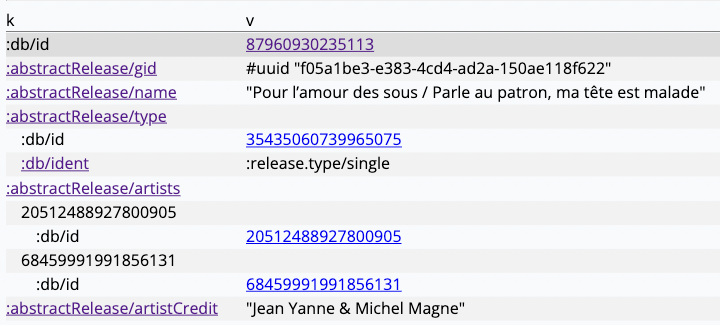

# Electric Datomic Browser


You need [Datomic pro](https://docs.datomic.com/pro/releases.html) (now free!) to run this demo.

## Getting started
To get Datomic and install the sample data set:
```shell
./datomic_fixtures.sh
```

Run Datomic:
```shell
./state/datomic-pro/bin/transactor config/samples/dev-transactor-template.properties >>state/datomic.log 2>&1 &
```

Run Electric Fiddle:
```shell
clj -A:dev:datomic-browser
```
At the repl:
```clojure
(dev/-main)
(dev/load-fiddle! 'datomic-browser)
```

Open your browser at [http://localhost:8080](http://localhost:8080).


# Motivation

Today, Cognitect's REBL and other GUI data browsers are architected as desktop
applications, because their expressive power comes from the **datafy/nav programming
model**, where the GUI view process is co-located with the backend data sources, so that
the view can directly query and traverse backend data structures as if at the REPL
(data-navigate = fn composition).

The consequence of this co-located architecture is that these data browsers are
historically not architected as web applications, because the **frontend/backend web app
plumbing breaks composition**, which in turn breaks the data-nav=composition programming
model. And that means we can't run these in prod, so they aren't linkable/sharable, and
worst of all, we can't use the flexible and dynamic programming model based on
data-nav=composition to power mission-critical web applications that match how people
think.

Electric Clojure solves this at the technical layer by using **stream functions** to
abstract over the frontend/backend web boundary, permitting a data-nav=composition
programming model to work with high performance despite the client/server architecture.

https://user-images.githubusercontent.com/124158/219978031-939344eb-4489-4b97-af9f-4b2df38c70db.mp4

*Video: this web-based data browser achieves high performance while still being coded in
the data-nav=composition programming model.*

What's happening:

* full-stack web application
* Datomic Cloud database is on the backend
* Dynamic web frontend with filtering, query parameters, routing, web history, tree views
* Pagination is server-streamed and renders as an efficient virtual scroll.

The key idea here is not what the demo does, but how it is expressed in code:

* Demo is a single file namespace, 228 LOC: [datomic_browser.cljc](datomic_browser.cljc)
* The grid cell renderers, despite rendering on the frontend, have full backend access as
  if co-located.

Concretely, on the Entity Detail page, the valueType and cardianlity column renderers can
query the entity schema metadata directly, and intelligently resolve `:db/ident` when
available, so that a dynamic renderer can display the most human-friendly identity
representation available:



*Screenshot: the dynamic entity detail view from this Datomic browser.*

In this screenshot,
* the frontend key renderer queries backend schema to check if it matches a schema attr,
  hyperlinks to schema detail if so
  [L73-L74](https://github.com/hyperfiddle/electric-fiddle/blob/ff35c3cff867c9065ae1893824507a7830f13f0a/src/datomic_browser/datomic_browser.cljc#L73-L74)
* the frontend key renderer queries backend schema to check for human readable attr names
  [L16-L23](https://github.com/hyperfiddle/electric/blob/54b423cd0c88cbee6a2c9053f5912ee2c5ef7832/src/contrib/datomic_contrib.clj#L16-L23)
* Because it's dynamic, this view works on any tree data structure, not just Datomic
  entities. That's why the `k` column renderer can expand into collections as a tree, with
  an

All of this is done inline in the cell renderer, **without any non-local coordination** to
prefetch, batch, cache or mirror entities on the frontend in a client-side db for fast
lookups. All that crap is gone—**all app logic is local!**—which means it is easy to
reason about. With Electric, as programmers, we no longer need to think about or even care
which site their data source exists at. Simply use what you need, and Electric will take
care of the plumbing. De-load your mind and relax!

In essence, Electric's property of **"network-transparent composition"** is designed to
make possible a datafy/nav implementation that spans the client/server network chasm, all
in a way designed to compose seamlessly with dynamic web frontend libraries. Therefore, we
think bringing this browser demo to parity with, say, Cognitect REBL (but for the web) is
a straightforward exercise. And not just that—we can now use data-nav=composition
abstractions as a foundation for full-on applications.

This is the technical thesis of the Hyperfiddle project. Now armed with
network-transparent composition, how much further can our programming abstractions scale,
before reaching performance limits that leak incidental platform implementation
details/plumbing, that have nothing to do with the business problem at hand? What % of the
LOC that we write today, is spent dealing with leaky abstractions?
